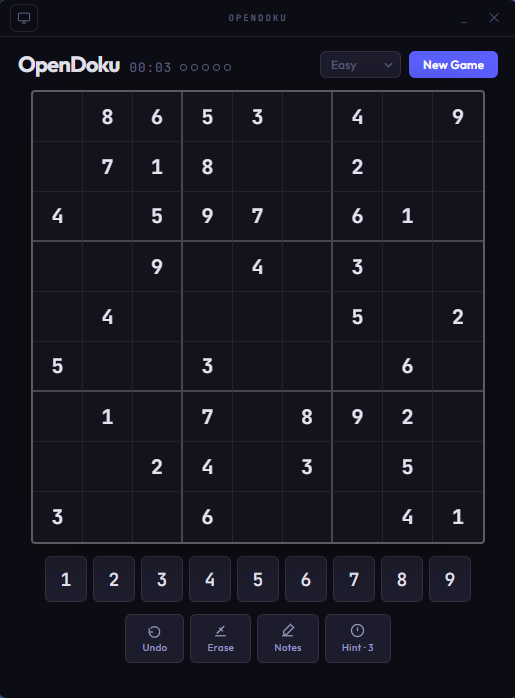

# ░▒▓ OpenDoku ▓▒░

**A clean, open-source Sudoku app for your desktop.**  
Frameless window, three themes, mistake limits, auto-save — no ads, no accounts, no internet.

> Built with Python + pywebview · Windows · macOS · Linux

---

## Preview



Four difficulties, dark/light/auto theme, mistake pips, pencil marks, 3 hints per puzzle.

---

## Features

| | |
|---|---|
| **Themes** | Dark · Light · Auto (follows OS) |
| **Frameless window** | Custom title bar — drag to move |
| **Four difficulties** | Easy · Medium · Hard · Expert |
| **Mistake limit** | Easy 5 · Medium 4 · Hard 3 · Expert 2 |
| **Limited hints** | 3 per puzzle |
| **Pencil marks** | Notes mode for candidates |
| **Undo** | Unlimited — mistakes not refunded |
| **Auto-save** | Resumes exactly where you left off |
| **Keyboard** | Arrows · 1–9 · Backspace · Ctrl+Z |

---

## Install

### Windows — automatic (recommended)

**Option A — direct download** *(recommended)*

1. Download **[OpenDoku.exe](https://github.com/mietek64/opendoku/releases/latest/download/OpenDoku.exe)**
2. Place it anywhere and run it — no installation needed

**Option B — PowerShell one-liner**

```powershell
irm https://github.com/mietek64/opendoku/releases/latest/download/OpenDoku.exe -OutFile "$env:USERPROFILE\Desktop\OpenDoku.exe"
```

Downloads `OpenDoku.exe` straight to your Desktop.

> **SmartScreen note:** Windows may show a warning the first time you run the app because it is not code-signed. Click **More info → Run anyway**. This is a known behaviour for unsigned open-source executables. The full source is in this repo — build it yourself if you prefer.

### macOS & Linux

No pre-built binaries yet. Run from source or build your own — see [Build from Source](#build-from-source).

---

## Usage

```
Double-click OpenDoku.exe   launch the app
python main.py              run from source
python main.py --debug      run with DevTools open
```

**Keyboard shortcuts**

| Key | Action |
|---|---|
| `1` – `9` | Enter a number |
| `Backspace` / `Delete` / `0` | Erase cell |
| `Arrow keys` | Navigate the board |
| `N` | Toggle notes mode |
| `Ctrl + Z` / `Cmd + Z` | Undo |

---

## Build from Source

Requires **Python 3.13**.

### Windows

```powershell
git clone https://github.com/mietek64/opendoku.git
cd opendoku
py -3.13 -m venv .venv
.venv\Scripts\activate
pip install .[build]

pyinstaller --onefile --windowed ^
  --add-data "index.html;." ^
  --add-data "style.css;." ^
  --add-data "script.js;." ^
  --name "OpenDoku" main.py
```

### macOS

```bash
git clone https://github.com/mietek64/opendoku.git
cd opendoku
python3.13 -m venv .venv && source .venv/bin/activate
pip install .[build]

pyinstaller --onefile --windowed \
  --add-data "index.html:." \
  --add-data "style.css:." \
  --add-data "script.js:." \
  --name "OpenDoku" main.py
```

### Linux

Install WebKitGTK first:

```bash
# Debian / Ubuntu
sudo apt install python3-gi python3-gi-cairo gir1.2-gtk-3.0 gir1.2-webkit2-4.0

# Fedora
sudo dnf install python3-gobject webkit2gtk4.0

# Arch
sudo pacman -S python-gobject webkit2gtk
```

Then build:

```bash
git clone https://github.com/mietek64/opendoku.git
cd opendoku
python3.13 -m venv .venv && source .venv/bin/activate
pip install .[build]

pyinstaller --onefile \
  --add-data "index.html:." \
  --add-data "style.css:." \
  --add-data "script.js:." \
  --name "OpenDoku" main.py
```

Output: `dist/OpenDoku.exe` (Windows) · `dist/OpenDoku` (macOS/Linux).

---

## Save Data

State is saved automatically after every move and restored on relaunch.

| Platform | Path |
|---|---|
| Windows | `%APPDATA%\OpenDoku\state.json` |
| macOS | `~/Library/Application Support/OpenDoku/state.json` |
| Linux | `~/.config/OpenDoku/state.json` |

---

## Project Structure

```
opendoku/
├── main.py           Python entry point & pywebview window API
├── index.html        App shell and layout
├── style.css         Themes: dark · light · auto
├── script.js         Sudoku engine, game state, UI controller
├── pyproject.toml
├── preview.png
├── README.md
├── LICENSE
├── SECURITY.md
├── CONTRIBUTING.md
├── CHANGELOG.md
└── .gitignore
```

---

## Contributing

Contributions are welcome. Please read [CONTRIBUTING.md](CONTRIBUTING.md) before opening a pull request.

---

## License

MIT — see [LICENSE](LICENSE).
